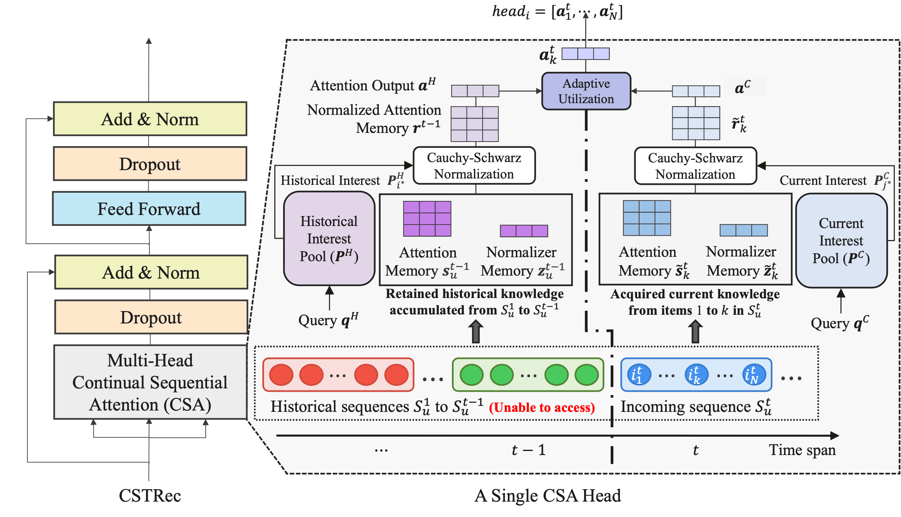

# 1. Overview
This repository provides the source code of our paper, Capturing User Interests from Data Streams
for Continual Sequential Recommendation(CSTRec).




# 2. Environment
```
conda env create --file env.yml
conda active CSTRec
```

# 3. Command
```
python main_eval.py --d ml-1m --m CSR
```